# __Now We Flip__ - Interactive Memory Game 

_Now We Flip_ is the _"Rock, Paper, Scissors"_ meets the _"Memory"_ game. The intention was to create an interactive game that was something more than just a "find 2 matching cards" game.
I wanted to make slightly more complex and hopefully more interesting card matching system by adding additional outcomes for the 2 cards flipped (apart from standard two outcomes: 1 - matching; 2 - not matching) and making things more dynamic by having cards creating different types of matches with different cards.
This was possible with throwing in a _"Rock, Paper, Scissors"_ game mechanic, where 3 different results can be rendered for each card, ex: 1 - Rock ties with Rock; 2 - Rock beats Scissors; 3 - Rock gets beaten by Paper.
In this game the player has to memorise the positions of the cards in such a way that the own - green cards eliminate and don't get eliminated by the red cards.
I have tested this game extensively in real life with my kids and the original mechanics of the game work quite well, but the full mechanics didn't fit the scope of this project, therefore there is a big potential for further development (explained in detail below).

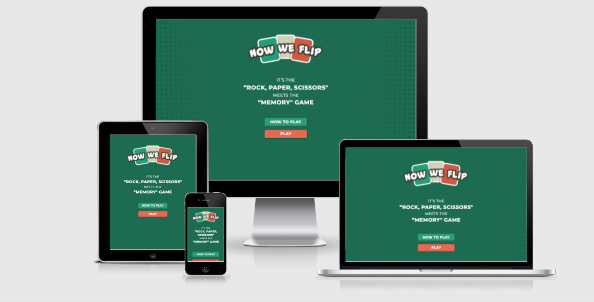

# Link to live project - [CLICK HERE](https://lukaszpasich.github.io/Now-We-Flip-MS2-/index.html)

#### Contents
1. [UX](#ux)
	- [User Goals (Strategy)](#user-goals)
	- [Stakeholder Goals (Strategy)](#stakeholder-goals)
	- [User Stories (Strategy)](#user-stories)
	- [Project Scope (Scope)](#project-scope)
	- [Information Architecture - Game Flow Chart (Structure)](#information-architecture---game-flow-chart)
	- [Wireframes (low fidelity wireframes) (Skeleton)](#wireframes-(low-fidelity))
	- [Prototype (high fidelity wireframes) (Skeleton)](#prototype-(high-fidelity))
	- [Design (Surface)](#design)
2. [Features](#features)
	- [Landing Page](#landing-page)
    - [How to Play Page](#how-to-play-page)
    - [The Game](#the-game)
    - [Score track](#score-track)
    - [Eliminated Cards Track](#eliminated-cards-track)
    - [End of the Game Message](#end-of-the-game-message)
	- [Features to Implement in the Future](#features-to-implement-in-the-future)
3. [Technologies](#technologies)
	- [Tools](#tools)
	- [Libraries](#libraries)
	- [Languages](#languages)
4. [Testing](#testing)
	- [Automated Testing](#automated-testing)
	- [UX Testing](#ux-testing)
	- [Manual Testing](#manual-testing)
	- [Bugs](#bugs)
5. [Deployment](#deployment)
    - [Github Pages Deployment](#github-pages-deployment)
    - [Cloning](#cloning)
6. [Credits](#credits)
	- [Content](#content)
	- [Media](#media)
	- [Code](#code)
    - [Resources](#resources)
	- [Acknowledgements](#acknowledgements)
7. [Contact](#contact)

---

## UX

### User Goals.
- Pass time and have fun playing a simple, enjoyable game - an outlet for a quick procrastination moment.
- Jog the memory with the challenge presented by the game.
- Discover an original game mechaninc mix.

### Stakeholder Goals
- Create a game experience that will attract users to the website, keep users playing (staying on the website) and coming back to play the game (returning users).

### User Stories

1. As a first time user I want the game interface to be simple and easy to navigate, I want to be able to proceed to play the game without unnecessary delays, settings or other non-play interaction with the website.
2. As a first time user I want the rules of the game to be explained, outlining clearly all rules, scoring system and winning/losing conditions.
3. As a user of the game I want the game to be laid out clearly, with an intuitive interaction.
4. As a user of the game I want to be able to click on what I expect being clickable in the game and receive feedback to my actions from the game.
5. As a user of the game I expect any unpredicted interaction to be handled or prevented so that the game can't be unexpectedly broken, thus ruining the gaming experience.
6. As a returning user I want the game to be quick and fun enough, so that I would like to play it again and again.
7. As a returning user I want the game to have some way of increasing game difficulty, so that the game remains challenging, interesting and makes me come back to play it again.

### Project Scope
Originally the game came to life on an actual real table with the real cards and was supposed to be a 2-player game.
I have tested it many times and the mechanics passed my own playability test, but a lot of features have been re-evaluated during the course of development.

The original real life tested concept:

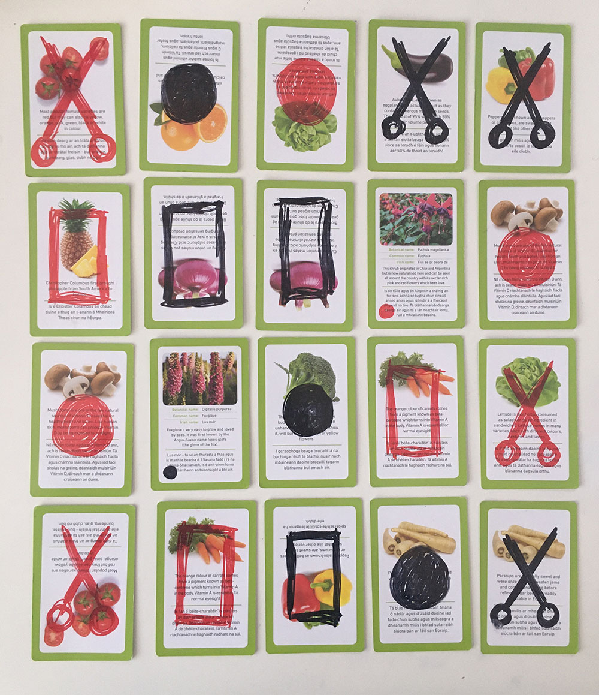

All game features have been scaled down to just:
- __Solitaire game__ - interactive memory card game with objective of using green cards to eliminate red cards in a "Rock, paper, scissors" card match. 
- __Score track__ - calculating and displaying points after every 2-cards flip.
- __Lost cards track__ - keeping track of eliminated cards and displaying them by fading out corresponding icons (icons displayed on either sides of the cards, or above and below cards on mobile version of the game).
- __How to play__ - explanation of the rules of the game.

The features that had to be abandonded were:
- __Players vs. Player game__ - I decided that asking 2 players swapping mouse every 2 clicks was a poor UX.
- __Player vs. Computer game__ - this feature has been abondened due to complexity of creating a Computer player.
I decided that the only way I can make this game a solo game with current dev skills available is by adapting a 2-player game into a solo game.
The player will do all the card turns trying to avoid pairs where green card could be eliminated (in the normal player vs. player mode players would actively seek to eliminate the opponent's colour).
- __X card activated__ - this feature has also been abandoned due to complexity.
In the original game the X card was suppose to act as a 4th card in the suit that a player loses first (ex. as soon as the three green Rocks were eliminated - as player's first full suit eliminated - the green X had become another green Rock; also explained in the [prototype](https://xd.adobe.com/view/302ca869-8919-4726-a9ca-0125f59e3156-657f/)).
This feature worked really well in the game mechanic tests, but a combination of the looming deadline and insufficient level of dev skills moved this feature onto the 'Further Future Development' shelf.
- __Game Sounds & Music__ - also didn't make it to the final version. I was concerned with making the game work first and left this as a bonus feature in case I had more time left, but that didn't happen in the end.

### Information Architecture - Game Flow Chart

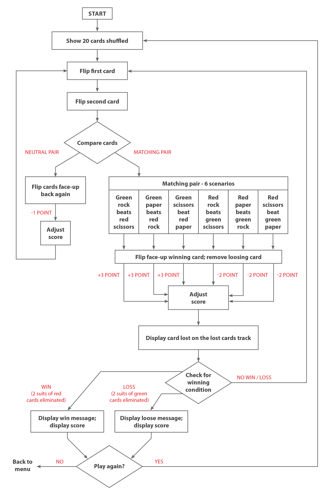

### Wireframes (low fidelity)
These wireframes follow the original concept, the final product has been modified couple of times and deviates slightly from the original concept.
- [Wireframes for the game AVAILABLE HERE](https://indd.adobe.com/view/41e1dcd7-ca60-4028-b5ac-60c370c98092)

### Prototype (high fidelity)
These prototypes follow the original concept, the final product has been modified couple of times and deviates slightly from the original concept.

- [Prototype - desktop version of the game AVAILABLE HERE](https://xd.adobe.com/view/302ca869-8919-4726-a9ca-0125f59e3156-657f/)
- [Prototype - mobile version of the game AVAILABLE HERE](https://xd.adobe.com/view/41f2cbf8-b4f8-4b1c-8561-e580ba0675ed-14a1/)

### Design

#### The Name

Why _"Now We Flip"_? It's the modification of the little countdown phrase that goes before the "Rock, paper, scissors" match - "Rock, paper, scissors, now we shoot!" - players throw their hand symbols on "shoot!". In case of _Now We Flip_ game the symbols are shown by flipping the cards.

#### Logo
The logo depicts three cards (unsurprisingly), representing 3 symbols - Rock, Paper and Scissors, each card also being a backdrop for one of the words of the name of the game. The animated gif version of the logo also does the little countdown phrase: "Rock, paper, scissors, now we flip!".

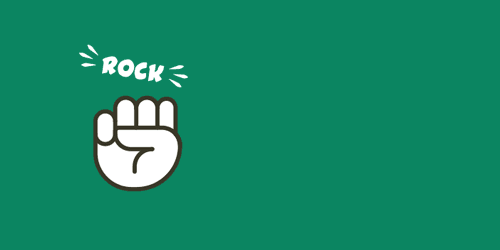

#### Colours
_Now We Flip_ game is a card game after all, so the general colour theme comes from trying to emulate the classic poker table feel.
As the game have two sets of card colours eliminating each other, I thought that the good colour to oppose the green side was red.
The beige is just a neutral colour complementary to red and green, it features mainly as background for the rules explaining section.
The three colours convey well the three different outcomes of the card matches: green - win, beige - neutral, red - lose.

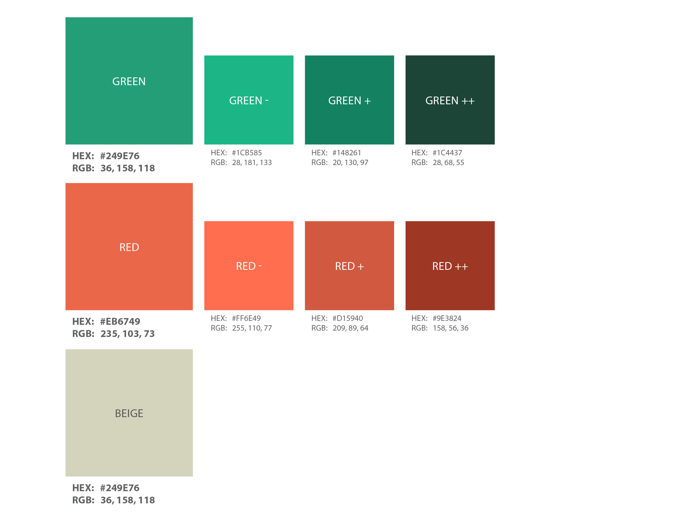

#### Typography
Font used is a geometric sans-serif typeface - Montserrat. It has quite informal feel which is perfect for the game.

[Back to top](#contents)

---

## Features
### Landing Page
The landing page introduces the logo, a short heading describing what the game is about and just two links unambiguously leading to 1) explanation of rules of the game, and 2) the game itself.

### How to Play Page

This page explains the rules of how to play the game, scoring system, and the condition for winning/ losing.

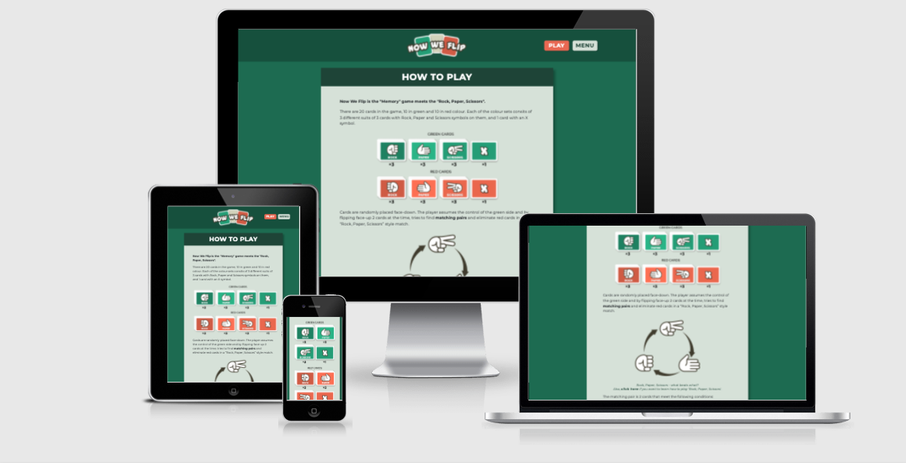

### The Game

_Now We Flip_ game mechanic works as a solitaire, card-flipping memory game.
The player flips two cards at the time trying to find the matching pairs of cards in a continuous sequence of turns.
The cards represent rock, paper and scissors symbols in two different colours (there are also two neutral cards with an X symbol) and two-card matches are resolved according to the "Rock, Paper, Scissors" rules (rock beats scissors, scissors beat paper, paper beats rock).
The player assumes control of the green cards and flips two cards seeking to find a pair where the green card would beat the red card.
When two cards are of the same colour or the same symbol or any of them is a card with an X symbol, the match will render a tie and both cards get flipped face-down back again - they remain in the game.
The winning condition is met when two full suits of RED cards have been eliminated (ex. 3x rock cards and 3x paper cards).
The losing condition is met when two full suits of GREEN cards have been eliminated.

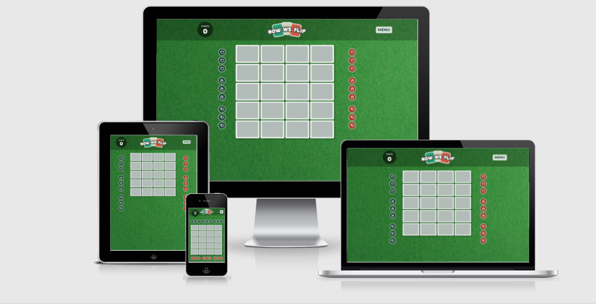

### Score Track

This feature counts the points and displays them in the top left corner of the screen after every pair of cards is flipped.
It also acts as a good feedback that the user gets from the game after every pair of cards is flipped.
The point count goes as follows:
- Winning pair counts as +3 points.
- Neutral pair counts as -1 point.
- Losing pair counts as -2 point.

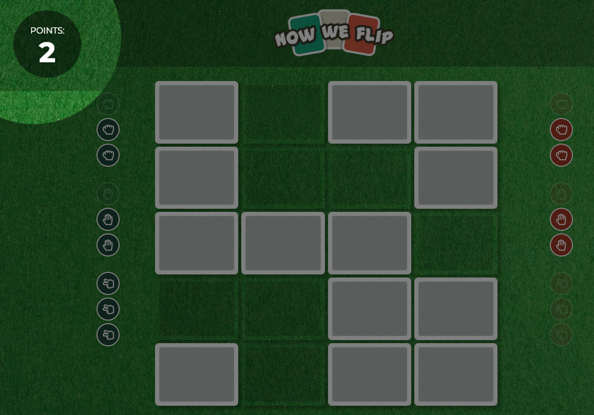

### Eliminated Cards Track

This feature keeps count of cards eliminated from the game and displays it in two columns (rows on small screens and mobiles) of icons representing all rock, paper and scissors cards remaining in the game for both colours.
It helps player to keep track of what cards have been eliminated on both sides, can therefore also help with making some decisions and help tracking how far away from winning/ losing condition the game currently is.
It is also a way of giving user the feedback from the game to the actions taken by the player.
Every time a card is eliminated, the little icon representing that card gets faded out.

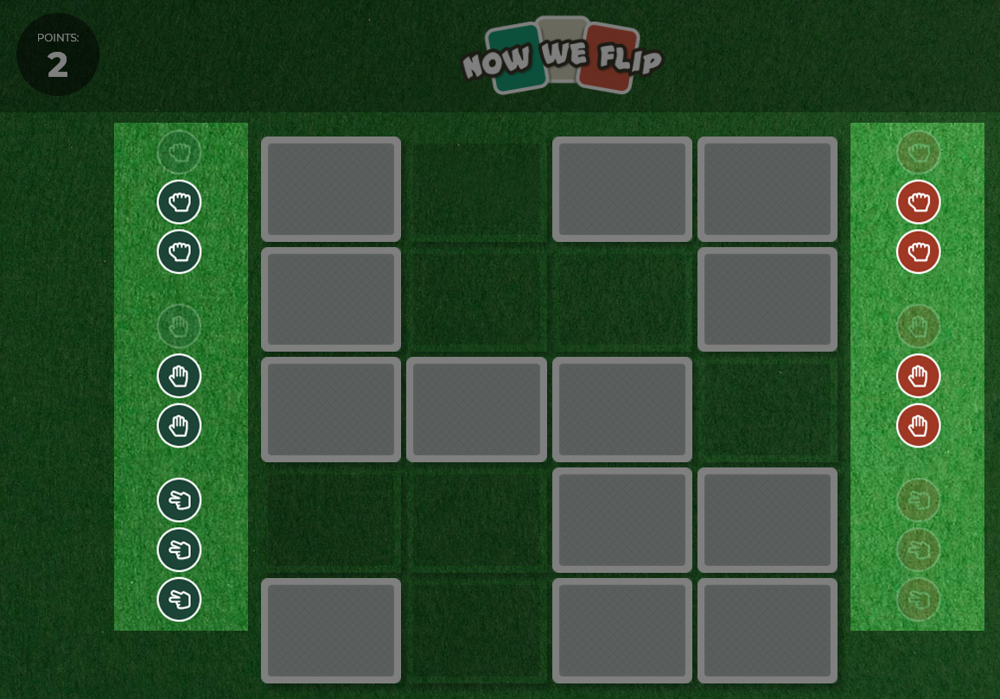

### End of the Game Message

A "Well Done!" message appears after winning condition is met, with the final score displayed and an option to play again or return to the main menu.

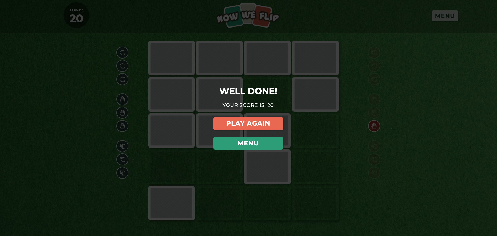

Similarly there is a lose message after losing condition is met.

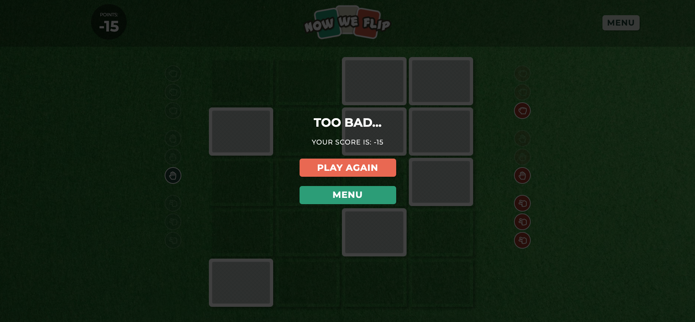

### Features to Implement in the Future
- __Player vs. Computer game__ - creating a computer player that would be in control of the red cards.
Have few levels of difficulty from easy computer that would do random card flips to difficult one remembering cards already uncovered.

- __X card activated__ - having the X card activated as the 4th card in the suit that a player loses first (ex. as soon as the three green Rocks would have been eliminated - as player's first full suit eliminated - the green X would have become another green Rock).
In game tests with real cards this proved to be an interesting, a chance-to-come-back and also a game extending mechanic.
- __Game Sounds & Music__ - some relaxing music in the background and card flip sound effects.
- __Players vs. Player game in an online setting__ - making this a green player vs. red player game would be more feasible if also players could match against each other online.
- __Bringing the game online__ - making it easier for players to battle each other but not being in front of the same screen.

[Back to top](#contents)

---

## Technologies
### Tools
- [GitHub](https://github.com) was an IDE used for the project.
- [GitPod](https://gitpod.io/workspaces/) was used for version control.
- [Balsamiq](https://balsamiq.com) was used to create low fidelity wireframes.
- [Adobe XD](https://www.adobe.com/ie/products/xd.html) was used to build the high fidelity prototypes.
- [Adobe Illustrator](https://www.adobe.com/ie/products/illustrator.html) was used to create the logo, cards and some images for _How to Play_ section.
- [Adobe Photoshop](https://www.adobe.com/ie/products/photoshop.html) was used to edit, crop and save images.
- [Am I Responsive](http://ami.responsivedesign.is) was used to create the images of each page displayed on different screen sizes in this _Readme_ file.

### Libraries
- [Bootstrap](https://getbootstrap.com/) grids were used in particular to create and maintain the design layout across different screen/viewport sizes and make the website responsive easily.
- [Google Fonts](https://fonts.google.com) was used to link the "Montserrat" font.
- [Font Awesome](https://fontawesome.com) was used for _play_ and _menu_ icons in the header of the _How to Play_ page and for all the icons of the _Eliminated cards track_.

### Languages
- HTML
- CSS
- JavaScript

[Back to top](#contents)

---

## Testing

### Automated Testing
- [W3C Markup Validator](https://validator.w3.org/) was used for HTML validation:
	- _Landing page_ validator result [HERE](https://validator.w3.org/nu/?doc=https%3A%2F%2Flukaszpasich.github.io%2FNow-We-Flip-MS2-%2Findex.html) - Errors: 0, Warnings: 0
    - _How to Play page_ validator result [HERE](https://validator.w3.org/nu/?doc=https%3A%2F%2Flukaszpasich.github.io%2FNow-We-Flip-MS2-%2Fhowplay.html) - Errors: 0, Warnings: 0
    - _Play page_ validator result [HERE](https://validator.w3.org/nu/?doc=https%3A%2F%2Flukaszpasich.github.io%2FNow-We-Flip-MS2-%2Fplay.html) - Errors: 0, Warnings: 0

- [W3C CSS Validator](https://jigsaw.w3.org/css-validator/) was used for CSS validation:
	- CSS validation result [HERE](https://jigsaw.w3.org/css-validator/validator?uri=https%3A%2F%2Flukaszpasich.github.io%2FNow-We-Flip-MS2-%2Fassets%2Fcss%2Fstyle.css&profile=css3svg&usermedium=all&warning=1&vextwarning=&lang=en) - Errors: 0

- [JSHint](https://jshint.com/) was used for JavaScript validation (New JavaScript features (ES6) were selected in configuration):
    - JavaScript validation - Errors: 0

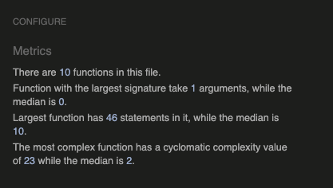

- [Web Accessibility](https://www.webaccessibility.com) was used to validate website's accessibility:
	- _Landing page_ accessibility test result [HERE](https://www.webaccessibility.com/results/?url=https%3A%2F%2Flukaszpasich.github.io%2FNow-We-Flip-MS2-%2Findex.html) - Violations: 0, Compliance score: 92%
    - _How to Play page_ accessibility test result [HERE](https://www.webaccessibility.com/results/?url=https%3A%2F%2Flukaszpasich.github.io%2FNow-We-Flip-MS2-%2Fhowplay.html) - Violations: 0, Compliance score: 92%
    - _Play page_ accessibility test result [HERE](https://www.webaccessibility.com/results/?url=https%3A%2F%2Flukaszpasich.github.io%2FNow-We-Flip-MS2-%2Fplay.html) - Violations: 0, Compliance score: 92%
	
- [Google Mobile Friendly Test](https://search.google.com/test/mobile-friendly) was used to test responsiveness of the website:
	- _Landing page_ responsiveness test result [HERE](https://search.google.com/test/mobile-friendly?id=8XoP7to8O-pbY47_KNvx0g) - Mobile friendly
    - _How to Play page_ responsiveness test result [HERE](https://search.google.com/test/mobile-friendly?id=dIpQYl5bCfoR68sNtZPsCA) - Mobile friendly
    - _Play page_ responsiveness test result [HERE](https://search.google.com/test/mobile-friendly?id=2t2ip-zM1p17v6qMksep0Q) - Mobile friendly
	
	
### UX Testing
#### User Stories Testing

1. As a first time user I want the game interface to be simple and easy to navigate, I want to be able to proceed to play the game without unnecessary delays, settings or other non-play interaction with the website.
    - The whole game has just 3 sections: landing page, game instructions and the game itself.
    - Navigation is simple with large, easy to identify buttons linking the three sections.
    - The logo always links back to the landing page.
    - The game is ready to be played once the user hits the _Play_ button. 

2. As a first time user I want the rules of the game to be explained, outlining clearly all rules, scoring system and winning/losing conditions.
    - There is a _How to Play_ section explaining the rules of the game with examples.
    - For users who are not familiar with the "Rock, Paper, Scissors" game, there is a link to external page explaining those rules in detail.

3. As a user of the game I want the game to be laid out clearly, with an intuitive interaction.
    - The layout of the game is simple and predictable, with cards taking the centre of the layout and points tracker in the top left corner.
    - The cards lost tracker is not an expected feature, but once the user learns about it's purpose in _How to Play_ section, the layout makes sense.

4. As a user of the game I want to be able to click on what I expect being clickable in the game and receive feedback to my actions from the game.
    - All buttons linking between different sections of the game have hover effects.
    - The game is quite intuitive with only large cards to activate on mouse click.

5. As a user of the game I expect any unpredicted interaction to be handled or prevented so that the game can't be unexpectedly broken, thus ruining the gaming experience.
    - The possibility of selecting more than 2 cards in one turn has been prevented.
    - Double clicking on the same card and registering it as 2 different cards has been prevented.
    - The score tracking has worked fine in multiple manual tests.
    - The eliminated cards tracking has worked fine in multiple manual tests.
    - The winning / losing condition has worked fine in multiple manual tests.
    - The cards compare has worked fine in multiple manual tests.

6. As a returning user I want the game to be quick and fun enough, so that I would like to play it again and again.
    - A single game takes under 1 minute.
    - The game features an interesting "Rock, Paper, Scissors" based card comparison mechanic, which makes the game a little bit more than just a memory card game, introducing an element of a battle against an opponent.
7. As a returning user I want the game to have some way of increasing game difficulty, so that the game remains challenging, interesting and makes me come back to play it again.
    - There isn't a lot to offer to scale up the difficulty level, but users can always return to try to beat their score. With some luck and good memory the maximum score a player can get is 24 points.

### Manual Testing
#### Features Working Correctly (in various screen sizes) Check
- Landing Page
    - hh
- How to Play Page
- The Game
- Score track
- Eliminated Cards Track
- End of the Game Message
- Features to Implement in the Future
	

#### Various Internet Browsers Check

Website has been tested on the following Internet Browsers:

- Google Chrome - no issues detected
- Safari - no issues detected
- Mozilla Firefox - no issues detected
- Microsoft Edge - no issues detected
	
#### Various Devices Check

Website has been checked on Desktop, Laptop and iPhone6. No issues specific to devices were discovered.
	
### Bugs

#### Bugs Fixed
1.	- PROBLEM: description...
	- SOLUTION: description...

#### Bugs not Fixed
1.	- PROBLEM: description...
	- SOLUTION: description...

img src="assets/images_readme/ms2-readme-testing-bugnotfix1.png" alt="Now We Flip website - bugs not fixed">

[Back to top](#contents)

---

## Deployment

### GitHub Pages Deployment

The project was deployed to GitHub Pages using the following steps...

1. Log in to GitHub and locate the [GitHub Repository](https://github.com).
2. At the top of the Repository, locate the _Settings_ button on the menu and click on it.

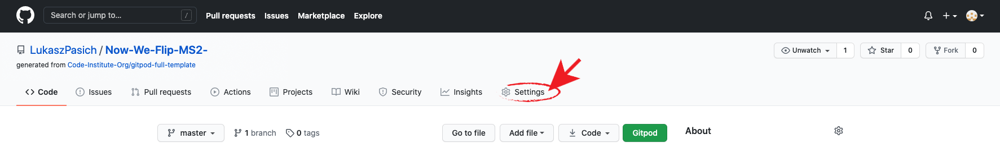

3. Scroll down the Settings page until you locate the _GitHub Pages_ section.

4. Under _Source_, click the dropdown _Branch: None_ and select _Branch: Master_.

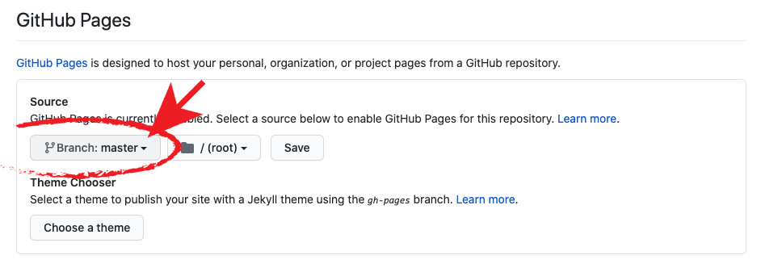

5. The page will automatically refresh.
6. Scroll back down through the page to locate the now published site link in the _GitHub Pages_ section.

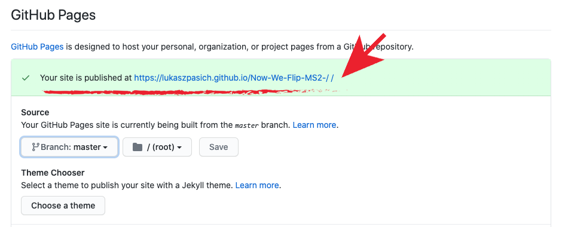

7. The project has been now deployed - the link can be opened in the browser.

### Cloning

Description of cloning steps.

[Back to top](#contents)

---

## Credits
### Content
The textual content was influenced by or taken from the websites:
- [Website Name](https://www....)

### Media
- Rock, Paper, Scissors icons - by nightwolfdezines, downloaded from [www.vecteezy.com](https://www.vecteezy.com/vector-art/690865-rock-paper-scissors-line-icons)
- Poker table felt background - by klikk, downloaded from [www.adobestock.com](https://stock.adobe.com/ie/images/poker-table-felt/1414609)

### Code
- Code/feature description - code found on _www...._ website [https://www....](https://www....), (style.css file lines 000-000). 

### Resources
Websites I have accessed for solutions/ questions and extra resources:
- [www.w3schools.com](https://www.w3schools.com)
- [www.stackoverflow.com](https://stackoverflow.com)
- [www.developer.mozilla.org](https://developer.mozilla.org/en-US/)
- [www.css.tricks.com](https://css-tricks.com)
- [Code Institute course content](https://codeinstitute.net/)

### Acknowledgements
- Thank you to my mentor __Nishant Kumar__ for his guidance, support and continuous helpful feedback throughout this project.
- Tutor Support at Code Institute and the Slack Community for a solution to any question at any time.

[Back to top](#contents)

---

## Contact
For any queries related to this project, you can contact me at: lukas (dot) zed81 (at) gmail (dot) com.

[Back to top](#contents)

---

## THANK YOU FOR TAKING TIME TO VIEW THIS PROJECT!